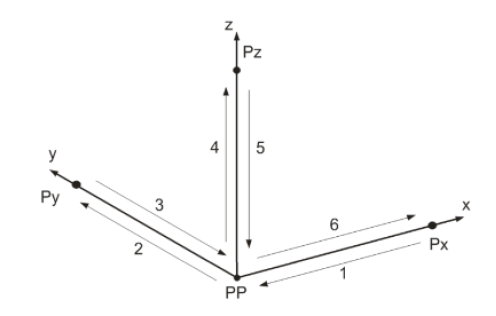
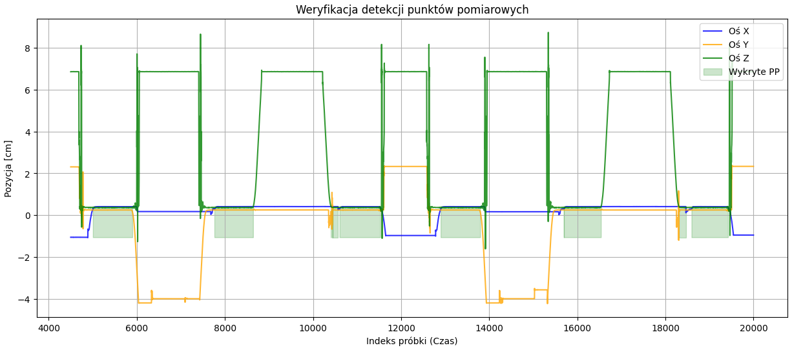
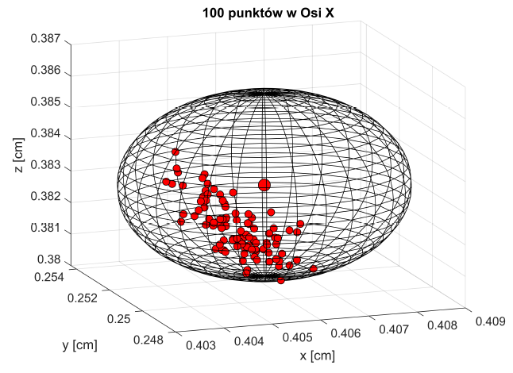
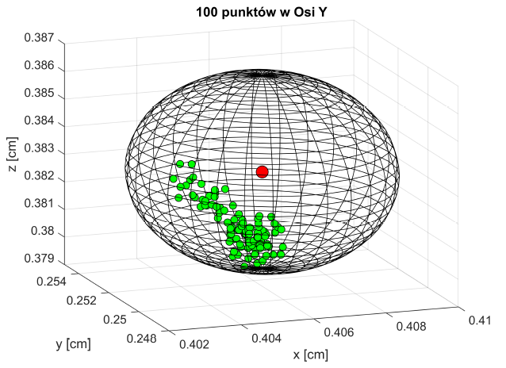
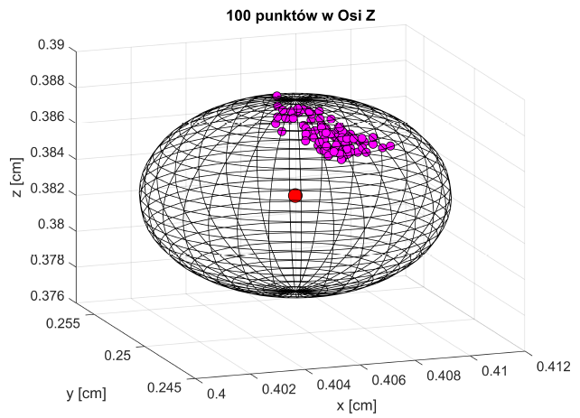

# Badanie powtarzalności pozycjonowania robota KUKA KR 6 R900 Sixx Agilus przy użyciu algorytmów uczenia maszynowego


## 1. Wprowadzenie
Projekt ma na celu zbadanie powtarzalności pozycjonowania (RP) manipulatora KUKA KR 6 R900 Sixx Agilus. Badanie polega na wielokrotnym przemieszczaniu robota do położenia zadanego (PP) z trzech różnych kierunków - wzdłuż osi X, Y i Z. Powtarzalność wg. producenta = 0.03mm

Głównym uproszczeniem projektu jest zastąpienie ręcznego wyodrębniania danych przez algorytm uczenia nienadzorowanego (DBSCAN), który automatycznie lokalizuje punkt pomiarowy w przestrzeni 3D i oddziela fazy postoju od fazy ruchu.



## 2. Środowisko

- Sprzęt: Robot KUKA KR 6 R900 Sixx Agilus, Czujniki OMRON Z4M i ZX2-LD100, Rejestrator TEAC GX-1.
- Oprogramowanie: Python 3.12, biblioteki: `pandas`, `numpy`, `matplotlib`, `scikit-learn`

## 3. Sposób akwizycji danych
Dane pomiarowe są rejestrowane z częstotliwością próbkowania 500 Hz przy użyciu filtru dolnoprzepustowego 200Hz. System pomiarowy wykorzystuje trzy czujniki przemieszczenia:

- Oś Z: Czujnik OMRON Z4M o czułości 1V/cm.
- Oś X i Y: Czujniki OMRON ZX2-LD100 o czułości 1,43 V/cm

Surowe dane (pliki `.txt`) mają następującą formę:

``` text
x_volt  y_volt  z_volt
0.5904  3.2280  6.8684
0.5896  3.2260  6.8680
0.5908  3.2256  6.8672
...
```

Algorytm automatycznie wykrywa stabilne fragmentu sygnału (zaznaczone na zielono), ignorując fazy przemieszczania się robota między punktami Px, Py, Pz a punktem PP.



## 4. Badania i algorytm uczenia maszynowego
Etapy zapewniające pełną automatyzacje i powtarzalność wyników:

1. Przestrzenna lokalizacja PP: Wykorzystanie histogramu 3D do wstępnego znalezienia obszaru o największym zagęszczeniu próbek.
2. Klasteryzacja DBSCAN: Model ML analizuje gęstość punktów w przestrzeni x, y, z. Wyznacza centroid punktu pomiarowego i odfiltrowuje trajektorie ruchu jako szum.
3. Segmentacja sesji: Automatyczne wyodrębnienie 300 unikalnych punktów pomiarowych PP (po 100 dla każdej osi)
4. Obliczenie powtarzalności:
  - Powtarzalność pozycjonowania ($RP$):
    
    $$RP = \bar{l} + 3S_l$$
    
  - Średnie odchylenie odległości ($\bar{l}$):
    
    $$\bar{l} = \frac{\sum_{i=1}^{n}l_i}{n}$$
    
  - Odchylenie standardowe odległości ($S_l$):
    
    $$S_l = \sqrt{\frac{\sum_{i=1}^{n}(l_i - \bar{l})^2}{n-1}}$$
    
  - Odległość punktu od barycentrum ($l_i$):
    
    $$l_i = \sqrt{(x_i - \bar{x})^2 + (y_i - \bar{y})^2 + (z_i - \bar{z})^2}$$

Całość analizy z wynikami jest dostępna w pliku: [Badanie powtarzalności](meas_detection.ipynb)

## 5. Wizualizacja
Dla każdej osi generowany jest wykres 3D przedstawiający chmurę 100 punktów pomiarowych oraz sferę, której promień odpowiada wyliczonej wartości RP. Pozwala to na graficzną ocenę stabilności pracy manipulatora.






